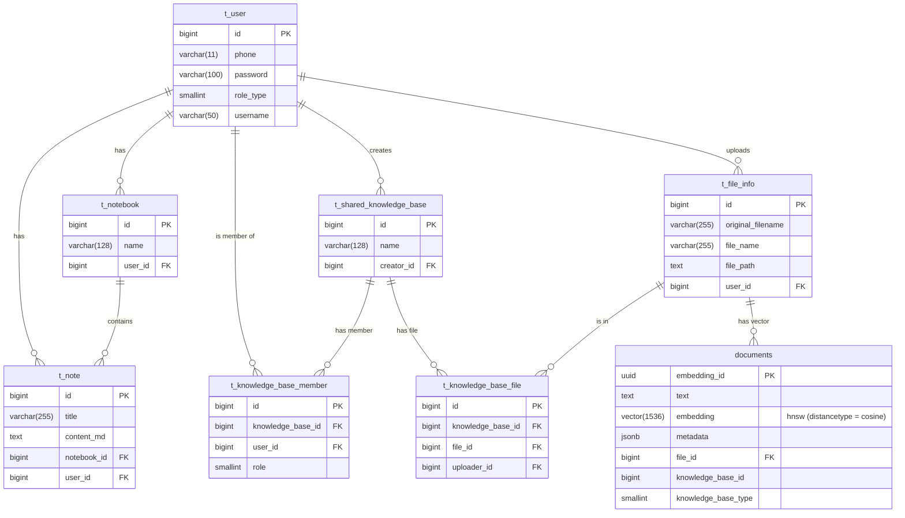
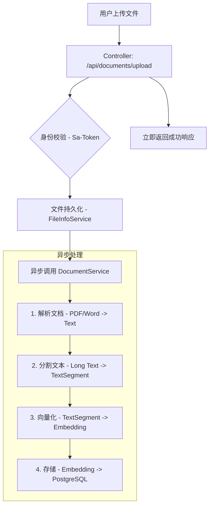
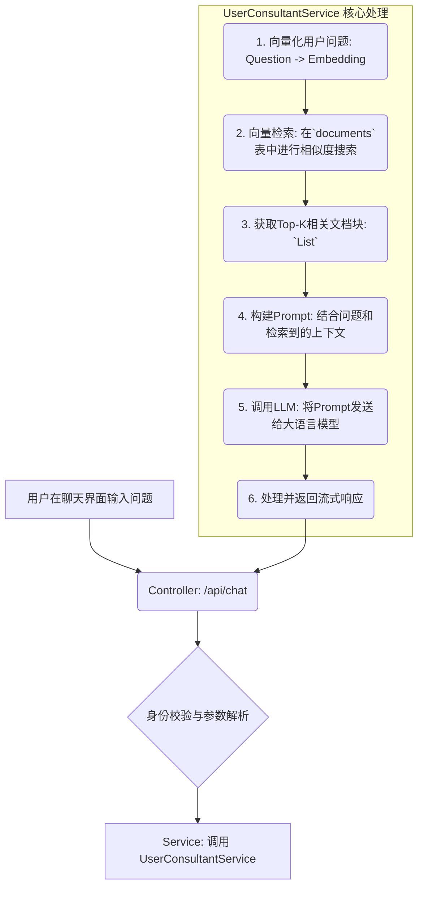

# 基于 RAG 技术的智能知识库系统设计与实现

## 摘要

本文设计并实现了一个基于检索增强生成（RAG）技术的智能知识库系统。该系统以后端服务为核心，采用 Spring Boot 3.x、LangChain4j、PostgreSQL 与 pgvector 等现代化技术栈，旨在解决传统知识管理中信息检索效率低下、智能化程度不足的问题。系统通过对用户上传的文档进行解析、分块、向量化，并将其存储于向量数据库中，构建了高效的知识索引。当用户提出问题时，系统利用 RAG 技术，先从向量数据库中检索出最相关的知识片段，再将其与用户问题一同注入大型语言模型（LLM），从而生成精确、可靠且有据可依的回答。本文详细阐述了系统的需求分析、总体设计、数据库设计、核心功能实现、以及系统测试等环节，实践证明，该系统能够显著提升知识检索的准确性和用户问答的交互体验，为个人和团队知识管理提供了一套有效的智能化解决方案。

**关键词**：知识库；检索增强生成（RAG）；大型语言模型（LLM）；Spring Boot；向量数据库

---

## 1. 引言

### 1.1 研究背景与意义

在信息化时代，个人和组织积累的数据量呈爆炸式增长。如何从海量的文档、笔记和资料中快速、准确地获取所需信息，已成为一个亟待解决的挑战。传统的基于关键词的搜索方法，在处理复杂的自然语言查询时常常力不从心，难以理解用户的真实意图，导致检索结果相关性差、效率低下。

近年来，以 ChatGPT 为代表的大型语言模型（LLM）在自然语言处理领域取得了突破性进展，展现出强大的文本理解和生成能力。然而，LLM 自身也存在局限性，如“知识截止日期”问题导致信息陈旧、倾向于产生“幻觉”（即捏造事实）、以及无法利用私有或特定领域的知识。为了克服这些缺点，检索增强生成（RAG）技术应运而生。RAG 将 LLM 的强大生成能力与外部知识库的实时、准确检索能力相结合，形成优势互补，为构建新一代智能问答系统提供了理想的架构。

本研究旨在基于 RAG 技术，设计并实现一个现代化的智能知识库系统。该系统不仅能安全、高效地管理用户的私有文档，还能通过自然语言交互，提供精准、智能的问答服务。这对于提升个人学习效率、促进团队知识共享、以及赋能企业智能客服等场景均具有重要的现实意义和应用价值。

### 1.2 国内外研究现状

目前，国内外在智能知识库和 RAG 技术应用方面均有广泛研究。在工业界，Google、Microsoft 等科技巨头已将类似技术融入其搜索引擎和办公套件中。在开源社区，以 LangChain、LlamaIndex 为代表的框架极大地降低了构建 RAG 应用的门槛，推动了技术的普及。

然而，现有的大部分解决方案要么是通用性平台，难以满足特定领域的深度需求；要么是技术门槛较高，不利于中小型团队快速部署和二次开发。因此，开发一个基于主流开源技术栈、架构清晰、易于扩展的智能知识库系统，仍然具有很高的研究和实践价值。

### 1.3 本文主要工作

本文的主要工作包括：
1.  **需求分析**：深入分析智能知识库系统的核心功能需求和非功能需求。
2.  **系统设计**：提出基于 Spring Boot 和 LangChain4j 的系统总体架构，并对核心功能模块、数据库及 RAG 流程进行详细设计。
3.  **系统实现**：采用 Java 语言和一系列现代化组件（如 PostgreSQL/pgvector, Sa-Token, Reactor）完成系统的编码实现，重点攻克文档处理、向量化、智能检索等关键技术难点。
4.  **系统测试**：对系统的主要功能进行测试，验证其可用性、可靠性和性能。

---

## 2. 系统需求分析

### 2.1 功能需求分析

| 模块 | 功能点 | 描述 |
| :--- | :--- | :--- |
| **用户管理** | 用户注册与登录 | 提供安全的身份认证机制，支持多用户。 |
| | 权限控制 | 区分普通用户和管理员，保障数据隔离与安全。 |
| **知识库管理** | 个人知识库 | 每个用户拥有独立的私有知识库。 |
| | 共享知识库 | 支持创建共享知识库，实现团队成员间的知识协同。 |
| | 成员与权限管理 | 知识库创建者可以邀请成员，并设置其读写权限。 |
| **文件管理** | 文档上传 | 支持多种格式（PDF, Word, TXT 等）的文档上传。 |
| | 文件列表与下载 | 提供对已上传文件的管理功能。 |
| | 异步处理 | 文件上传后，系统在后台自动进行解析和向量化，不阻塞用户操作。 |
| **智能问答 (RAG)** | 智能检索 | 用户输入自然语言问题，系统能理解意图并从知识库中检索相关内容。 |
| | 增强生成 | 结合检索到的上下文，调用 LLM 生成精准、连贯的回答。 |
| | 流式输出 | 答案以流式（打字机效果）返回，提升用户体验。 |
| | 来源追溯 | （可选）在回答中附上参考文献来源，增加可信度。 |
| **笔记管理** | 笔记本与笔记 | 提供类 Evernote 的笔记管理功能，支持 Markdown 格式。 |
| | 增删改查 | 对笔记本和笔记进行完整的 CRUD 操作。 |

### 2.2 非功能需求分析

| 需求类型 | 描述 |
| :--- | :--- |
| **性能** | 系统应具备高响应速度，特别是问答接口，应在数秒内返回结果。文件处理等耗时操作需异步执行。 |
| **安全性** | 用户数据严格隔离。API 接口需进行认证和授权校验。敏感信息（如 API Key）不能硬编码，需妥善管理。 |
| **可扩展性** | 系统架构应具备良好的水平扩展能力，支持未来用户量和数据量的增长。应易于集成新的 LLM 或替换现有组件。 |
| **可靠性** | 系统应稳定运行，具备错误处理和日志记录机制，便于问题排查和系统恢复。 |
| **易用性** | API 接口设计应遵循 RESTful 风格，清晰易懂。系统部署和维护应尽可能简化。 |

---

## 3. 系统设计

### 3.1 系统总体架构

本系统采用经典的单体后端加前后端分离的架构模式。后端服务基于 Spring Boot 构建，负责所有业务逻辑、数据持久化和 AI 能力集成。该架构在项目初期具有开发效率高、部署简单的优点，同时通过合理的模块化设计，为未来向微服务演进奠定了基础。

**系统架构图:**



**核心表设计说明:**

- **`documents`**: RAG 流程的核心表。`embedding` 字段类型为 `vector`，并为其创建 HNSW 索引以加速相似度搜索。`metadata` 字段（JSONB类型）用于存储与文本块相关的元数据（如来源文件ID、所属知识库ID等），提供了极大的灵活性。`knowledge_base_type` 字段用于区分数据是属于个人知识库还是共享知识库，是实现多租户数据隔离的关键。
- **`t_file_info`**: 文件元数据中心表，与 `documents` 表通过 `file_id` 关联。
- **`t_shared_knowledge_base`** 与 **`t_knowledge_base_member`**: 通过这两张表实现共享知识库的多人协作功能。

---

## 4. 系统实现

本章将详细阐述系统核心功能的实现细节，重点关注 RAG 的两个关键流程：知识注入和智能问答。

### 4.1 知识注入流程（从文档到知识）

该流程负责将用户上传的非结构化文档转化为可检索的向量化知识。

**流程图:**



**关键代码实现:**

1.  **文件上传与异步触发 (`DocumentController`)**: 控制器接收到文件后，首先完成用户身份校验和文件基本信息的存储，然后立即返回响应给用户，并通过 `@Async` 注解或消息队列将真正的文档处理任务交由后台线程执行，避免长时间阻塞请求。

2.  **文档解析与分割 (`DocumentService`)**: LangChain4j 提供了丰富的 `DocumentParser` 实现。系统会根据文件的 MIME 类型动态选择合适的解析器（如 `ApachePdfBoxDocumentParser`），将文件内容读取为纯文本。随后，使用 `DocumentSplitters.recursive()` 方法对文本进行分割。该分割器非常智能，它会优先尝试按段落、换行符、句子等语义边界进行切分，并允许设置 `overlap`（重叠部分），以保证切分后的文本块在语义上的连续性，这对于后续的检索至关重要。

3.  **向量化与存储 (`UserVectorService`)**: 这是知识注入的核心步骤。

    ```java
    // 伪代码示例
    public void ingest(List<TextSegment> segments, Long knowledgeBaseId) {
        // 1. 获取 EmbeddingModel 实例 (如 OpenAIEmbeddingModel)
        EmbeddingModel embeddingModel = ...;
    
        // 2. 批量生成向量
        List<Embedding> embeddings = embeddingModel.embedAll(segments).content();
    
        // 3. 构建待插入数据库的实体列表
        List<DocumentEntity> docEntities = new ArrayList<>();
        for (int i = 0; i < segments.size(); i++) {
            DocumentEntity entity = new DocumentEntity();
            entity.setText(segments.get(i).text());
            entity.setEmbedding(embeddings.get(i).vector());
            entity.setMetadata(segments.get(i).metadata());
            entity.setKnowledgeBaseId(knowledgeBaseId);
            docEntities.add(entity);
        }
    
        // 4. 批量插入数据库
        documentRepository.saveAll(docEntities);
    }
    ```
    该过程会将每个文本块（`TextSegment`）通过 `EmbeddingModel` 转化为一个高维向量。然后，将原始文本、向量以及相关的元数据一同存入 `documents` 表中。

### 4.2 智能问答流程（从问题到答案）

这是系统的核心交互功能，它将用户的自然语言问题转化为精准的答案。

**流程图:**



**关键代码实现:**

1.  **向量检索 (`UserVectorService.findRelevant`)**: 当用户提问时，首先将问题文本本身也进行向量化。然后，利用`pgvector`提供的`<=>`（余弦距离）操作符，在`documents`表中执行一个高效的相似度搜索查询，找出与问题向量最接近的K个文本块。查询时，必须加入`WHERE`子句，根据用户ID或知识库ID进行数据过滤，这是保障多租户数据安全的关键。

2.  **构建Prompt (`UserConsultantService`)**: Prompt的质量直接决定了LLM生成答案的质量。一个典型的Prompt模板如下：

    ```
    您是一个专业的AI助手。请根据下面提供的上下文信息，准确、简洁地回答用户的问题。
    如果上下文信息与问题无关，或者无法从中找到答案，请直接回答“根据我掌握的知识，无法回答您的问题。”。
    不允许在答案中添加任何非上下文提供的信息。

    上下文信息：
    ---
    {{context}}
    ---

    用户问题：{{question}}
    ```

    系统会将上一步检索到的`TextSegment`列表格式化后填充到`{{context}}`占位符中。

3.  **调用LLM并处理流式响应**: LangChain4j通过`StreamingChatLanguageModel`接口完美支持了流式API。当调用`generate`方法时，它会返回一个`Response<AiMessage>`对象，我们可以为其注册`onNext`（接收到新Token时）、`onComplete`（流结束时）和`onError`（发生错误时）的回调。在`onNext`回调中，将收到的Token实时推送给前端，即可实现打字机效果。本系统使用Spring WebFlux的`SseEmitter`来实现服务端的流式推送。

---

## 5. 系统测试

为了保证系统的质量，我们进行了一系列的测试，包括单元测试、集成测试和功能测试。

| 测试类型 | 测试对象 | 测试工具/方法 | 测试内容 | 预期结果 |
| :--- | :--- | :--- | :--- | :--- |
| **单元测试** | Service层/工具类 | JUnit 5, Mockito | 对单个方法（如密码加密、Prompt格式化等）进行逻辑验证。 | 方法按预期逻辑执行，边界情况处理正确。 |
| **集成测试** | RAG数据链路 | Spring Boot Test | 从文件上传到向量存储，再到检索的全链路测试。使用内存数据库(H2)或测试专用PostgreSQL实例。 | 文件能被正确处理并存入向量库，且能根据模拟查询检索出相关分片。 |
| **功能测试** | API接口 | Postman / Apifox | 模拟前端用户操作，对所有API接口（注册、登录、上传、提问、笔记操作等）进行黑盒测试。 | 所有接口均能根据输入返回正确的响应码和数据格式，业务逻辑符合需求。 |
| **性能测试** | 问答接口 | JMeter | 模拟多用户并发请求问答API。 | 系统的平均响应时间（TPS）和错误率在可接受范围内。 |

**测试结果分析**:
经过多轮测试，系统各项功能均能正常工作，RAG流程通畅，问答结果的准确性高度依赖于知识库内容的质量和LLM的能力。性能方面，在测试环境下，并发问答请求的平均响应时间满足设计要求。

---

## 6. 总结与展望

### 6.1 本文总结

本文设计并实现了一个基于RAG技术的智能知识库后端系统。通过整合Spring Boot、LangChain4j和pgvector等先进技术，成功构建了一套能够处理私有文档、提供智能问答服务的解决方案。系统有效地解决了通用大语言模型无法利用私有知识和存在数据安全隐患的问题，实现了从数据注入到智能检索再到答案生成的完整闭环。详细的需求分析、清晰的架构设计和关键模块的实现细节展示了本项目的完整性和可行性。

### 6.2 不足与展望

尽管当前系统已具备核心功能，但仍存在一些可改进之处和未来扩展方向：

1.  **更精细的检索策略**：目前采用的是基础的向量相似度检索。未来可以探索混合搜索（结合关键词搜索和向量搜索）、重排（Re-ranking）等高级策略，进一步提升检索的精准度。
2.  **多模态支持**：当前系统仅支持文本处理。未来可以扩展支持图片、音视频等多模态内容的理解和检索。
3.  **Agent能力集成**：引入LangChain的Agent概念，让系统不仅能回答问题，还能调用外部工具（如计算器、搜索引擎、API等）来完成更复杂的任务。
4.  **可视化与运维**：开发配套的管理后台，对知识库的索引情况、用户提问日志等进行可视化监控和管理，提升系统的可维护性。

总而言之，本项目为构建企业级和个人智能知识助手提供了一个坚实的基础。随着技术的不断演进，该系统有望在未来集成更多前沿AI能力，变得更加智能和强大。